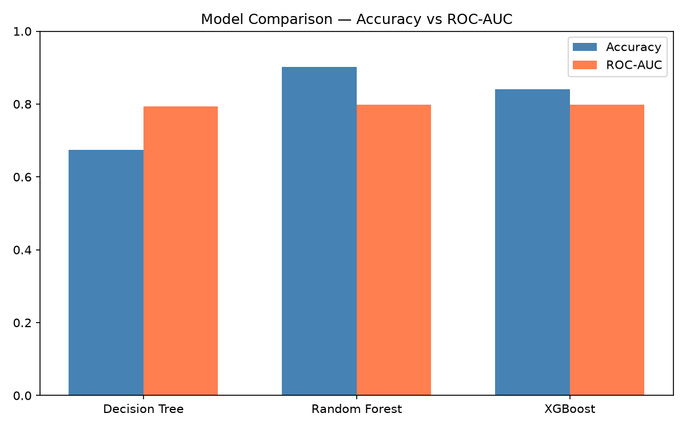
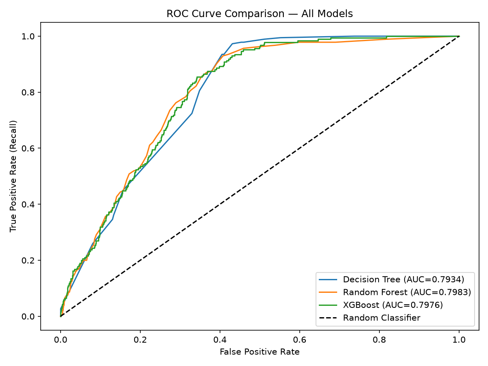
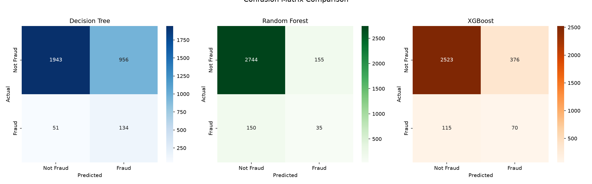
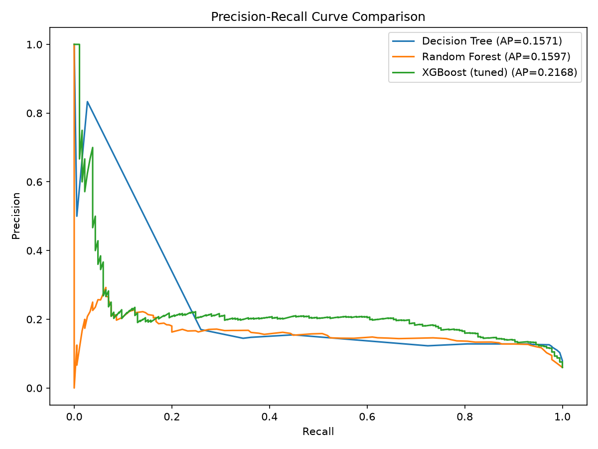

# Insurance Claim Fraud Detection using Decision Tree, Random Forest & XGBoost

## Problem Statement
Insurance companies lose significant revenue to fraudulent claims, but 
fraud is rare (~6% of claims) — making it a hard, imbalanced classification 
problem. This project builds and compares three machine learning models 
to flag suspicious motor insurance claims for investigation, with a focus 
on maximizing fraud detection (recall) at an acceptable false-positive cost.

## Dataset
- **Source:** Kaggle — "Vehicle Insurance Claim Fraud Detection" by Shivam Bansal
- **Size:** 15,420 claims, 33 columns
- **Target:** `FraudFound_P` (0 = not fraud, 1 = fraud)
- **Class imbalance:** ~6% fraud, ~94% non-fraud

## Tools Used
- **Python** — pandas, numpy, matplotlib, seaborn
- **scikit-learn** — DecisionTreeClassifier, RandomForestClassifier, 
  RandomizedSearchCV, StratifiedKFold
- **XGBoost** — XGBClassifier
- **imbalanced-learn** — SMOTE
- **JupyterLab** — analysis environment

## Approach
Data Loading & Cleaning

No nulls, dropped ID columns (PolicyNumber, RepNumber)
Dropped Year (low variance, misleading importance)

↓
EDA
Fraud rate by Fault, PolicyType, VehiclePrice
Fraud rate by PoliceReportFiled, WitnessPresent, AgentType

↓
Preprocessing
One-hot encoding for categorical features
Train/test split (stratified, 80/20)
SMOTE applied only on training data

↓
Model Building
Decision Tree (baseline)
Random Forest (bagging ensemble)
XGBoost (boosting, hyperparameter-tuned via RandomizedSearchCV)

↓
Evaluation
Precision, Recall, F1, ROC-AUC, PR-AUC (Average Precision)
Confusion matrices, ROC curves, Precision-Recall curves

↓
Threshold Optimization
Tuned decision threshold using PR curve to maximize F1

## Key EDA Findings
- Claims where the **Policy Holder is at fault** show an 8% fraud rate, 
  vs under 1% when a Third Party is at fault
- **Sport-Collision** policies have the highest fraud rate (14%)
- Claims with **no police report** or **no witness present** show 
  meaningfully higher fraud rates than those with a report/witness
- **External agents** are linked to a 6% fraud rate vs 1.7% for internal agents

## Model Performance

### Why Accuracy Is Misleading Here
With ~6% fraud, a model that predicts "not fraud" every time scores 
94% accuracy while catching zero fraud. Evaluation instead centers on 
**Recall** (fraud caught) and **Average Precision / PR-AUC** (the honest 
metric on imbalanced data).

### Model Comparison (default threshold)

| Model | Accuracy | ROC-AUC | PR-AUC (AP) | Fraud Recall |
|---|---|---|---|---|
| Decision Tree | 67% | 0.7934 | 0.1571 | 72% |
| Random Forest | 90% | 0.7983 | 0.1597 | 19% |
| XGBoost (tuned) | 93% | 0.8396 | **0.2168** | 7% |

Random Forest's 90% accuracy is misleading — it only catches 19% of 
actual fraud. XGBoost had the best PR-AUC (0.2168, ~3.6x better than 
a random baseline of ~0.06) but at the default 0.5 threshold, it was 
also too conservative, catching only 7% of fraud.

### Threshold Optimization — the key finding
The default classification threshold (0.5) is arbitrary on imbalanced 
data. Using the precision-recall curve to find the F1-optimal threshold 
(0.091) dramatically improved fraud detection:

| XGBoost Version | Threshold | Precision | Recall | F1 |
|---|---|---|---|---|
| Default | 0.500 | 0.24 | 0.07 | 0.11 |
| **Threshold-optimized** | **0.091** | **0.20** | **0.65** | **0.31** |

**Same model, same features — only the decision cutoff changed — and 
fraud recall rose from 7% to 65%.**

## Business Recommendation
> The tuned XGBoost model at an optimized threshold catches 65% of 
> fraudulent claims, at the cost of flagging more claims for review 
> (20% precision). Given that the cost of missing fraud is typically 
> higher than the cost of an extra manual review, this tradeoff is 
> justified. The model should be used as a **triage/prioritization tool** 
> — routing high-risk claims to human investigators — rather than an 
> automatic rejection system.

## Visualizations

## Author
**Riya Saini**

Tuned decision threshold using PR curve to maximize F1
↓
Business Recommendation
